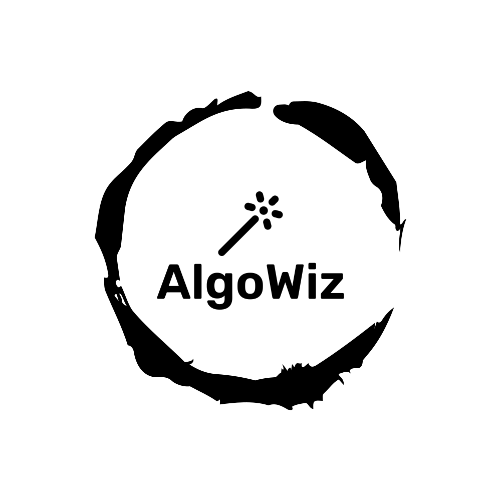

# AlgoWiz - A Wepp App to Visualise Algorithms

A webapp to visualise various algorithms in an easy-to-use UI. Algowiz aims to be a onestop for all things data-structures and algorithms, with emphasis over learning alongside visualisation, for better understanding and concept building. 

# Tech Stack
This web app uses the following tech stack - 

### Main Dependency

1. Next.js
2. TypeScript
3. @next/mdx
4. Chakra-UI
5. Emotion
6. Framer Motion
7. Markdown
8. React-Redux
9. @reduxjs/toolkit
10. RTK-Query

### Dev Dependency

I love writing `scalable code` hence I use a wide range of tools and methods to *scale* the project whenever required.

Some of the tools, I used to maintain this project for future updates and features are :-

1. Storybook
2. Eslint (custom rules for semantic styling in repository)
3. Prettier (custom rules for semantic styling in VSCode)

# Inspiration